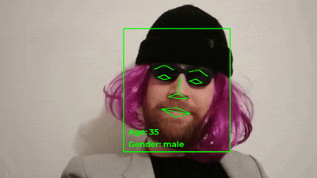

# video_face_detection

A small Python program which adds a face, gender and age detection annotations to a video.

* The face detection is made with [Google Cloud Vision API](https://cloud.google.com/vision/).
* The gender and age detections are made with [pre-trained Keras CNN by yu4u](https://github.com/yu4u/age-gender-estimation).

## Example output



## Installation and usage instructions

1. Clone this repository:

```shell
git clone --recursive git@github.com:tuomastik/video_face_detection.git
```

2. Prepare Python environment with [Conda](https://conda.io/docs/):

```shell
conda create -n video_face_detection python=3.5 scipy numpy pillow tensorflow keras
source activate video_face_detection
pip install google-cloud-vision==0.30.1
```

3. Install [FFmpeg](https://github.com/FFmpeg/FFmpeg) for video processing. On Linux, install by `sudo apt-get install ffmpeg`.

4. Put your Google Cloud Platform [service account key](https://console.cloud.google.com/apis/credentials) in the root directory of this repository with a name `gcp_service_account_key.json`.

5. Execute `main()` function in `main.py`. The script will start by downloading the weights for gender and age predictor:

```python
main(input_video_path="input.mp4",
     output_video_path="input_annotated.mp4",
     detection_start_time=2, detection_end_time=4,
     highlight_color="#00ff00", font="Montserrat-Bold.ttf", font_size=32,
     line_width_rectangle=4, line_width_face_parts=4, language=Language.english,
     draw_eyes=True, draw_eyebrows=True, draw_mouth=True, draw_nose=True)
```
